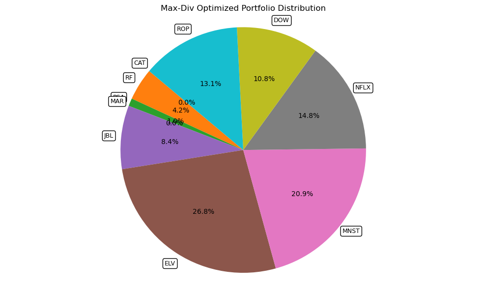

# StockDiversifier
A portoflio diversification algorithm based on Beta-autoencoders. 

You can find **our paper** [here](https://drive.google.com/file/d/1bBiyAiNFXPy7VHpLLDIeKA2812ldZlU9/view?usp=sharing).

## Instructions 

**Note:** A fully-working notebook is implemented under **tests/jair/test_driver.ipynb**; the script below contains bugs for now. 

Our project contains a driver that can be called thorugh `main.py`, with the following `help` menu: 

```
usage: main.py [-h] [--refetch] [--retrain] [--load_returns] [--verbose VERBOSE] [--recoms_filename RECOMS_FILENAME]
               [--num_portfolios NUM_PORTFOLIOS] [--num_initial_tickers NUM_INITIAL_TICKERS] [--optim_method OPTIM_METHOD]

Modify default configurations

options:
  -h, --help            show this help message and exit
  --refetch             Refetch the loaded sp500 data
  --retrain             Retrain the model
  --load_returns        Refetch returns data for all stocks
  --verbose VERBOSE     Verbosity level
  --recoms_filename RECOMS_FILENAME
                        Custom name for the output recommendation file
  --num_portfolios NUM_PORTFOLIOS
                        Number of portfolios to generate
  --num_initial_tickers NUM_INITIAL_TICKERS
                        Number of initial tickers in the portfolio
  --optim_method OPTIM_METHOD
                        Optimization method for the portfolio 
```

To run the whole experiment including refetching all data, retraining models, specifying 10 random portfolios with 10 tickers each under the default Max Diversification (`max_div`) optimization method, you can use: 

```
python main.py --refetch --retrain --num_portfolios 10 --num_initial_tickers 10
```

The argument `optim_method` also accepts `mean_variance` and `max_sharpe`, to perform portfolio optimization based on these. Experiments were not carried with the latter two methods. 

## Results 

### Optimizing an Equally-Weighted Portfolio with MaxDiv 

We focus on **Max Diversification** portfolios, which solve 


$$
\boxed{\
\begin{matrix}
 & \max_{\mathbf{w}}DR(\mathbf{w}) = \max_{\mathbf{w}} \dfrac{\mathbf{w}^\top \boldsymbol{\sigma}}{\sqrt{\mathbf{w}^\top \boldsymbol{\Sigma} \mathbf{w}}}  \\ \\ 
& \text{subject to} \displaystyle \sum_{j=1}^{p} w_j  = 1 \;\;\text{ and } \;\; \mathbf{w} \geq 0  \\ 
\end{matrix}
}
$$

For example, consider the equally-weighted following portfolio: 


Max-diversification optimization changes the portfolio distribution increasing the diversification ratio (DR): 


### Applying the Beta-Encoding-Diversification Algorithm 

Given any portfolio, the algorithm swaps stocks based on similarity measure to achieve a better DR with the same number of securities: 



After applying the algorithm, we obtain a diversification-optimized portfolio with slightly different securities but higher DR than the original portfolio: 


### Experiments on Random SP500 Portfolios 

We generate N different portfolios drawn from the SP500 tickers, we apply our algorithm and then check the performance in terms of the DR. 

**Average DR Improvement**

We compare the choice of Beta-VAE embeddings to PCA-Embeddings as a baseline: 

```
             Method  Average_Initial_DR  Average_Final_DR  \
0          Beta-VAE            2.335059          3.125257   
2  PCA (Latent Dim)            2.335059          2.726827   
1     PCA (90% Var)            2.335059          2.635625   

   Average_DR_Improvement  
0                34.97845  
2                17.18670  
1                13.37660 
```

We notice our method with Beta-VAE encodings choice obtains the best average DR across multiple randomly generated portfolios. 

**Top 3 DR-Improvement Portfolios** 

We can check the achieved metrics in terms of the top 3 best portfolios in terms of DR improvement. Additioanlly, we also show the Sharpe-Ratio (SR) related metrics: 

```
       Portfolio  Initial_DR  Final_DR  DR_Improvement  Initial_SR  Final_SR  \
48  Portfolio_17    2.008874  3.724985          85.426    0.264460  0.557309   
3    Portfolio_2    2.118884  3.826035          80.568    0.215653  0.517187   
6    Portfolio_3    2.234546  3.663383          63.943    0.378467  0.457902   

    SR_Improvement  
48         110.735  
3          139.824  
6           20.988  
```

We see that occassionally, our method produces additional significant SR improvements, but we notice this seems to be spurious and unreliable, as in other experiments we also obtain significant decreases in SR. 

## TODO 

- Fix bugs in `main.py` preventing the script from running smoothly when performing the experiment and portfolio udpates. 

